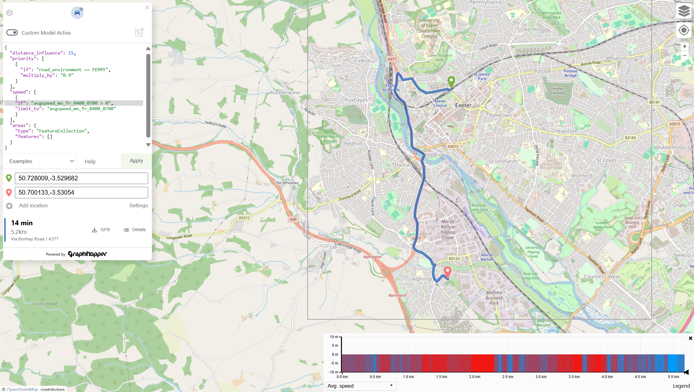

# graphhopper-samples

This project demonstrates how to set up and extend a custom Java web application using [GraphHopper](https://www.graphhopper.com/) for routing and map data processing.

## Features

- **Custom GraphHopper Integration:**  
  Uses `graphhopper-web` as a dependency for routing and map data.
- **Custom Encoded Values:**  
  Adds new time-dependent average speed encoded values (e.g., `avgspeed_mo_fr_0400_0700`) for advanced routing scenarios.
- **Custom Tag Parser:**  
  Implements `AvgSpeedConditionalParser` to parse and apply conditional average speed tags from OSM data.
- **Configurable via YAML:**  
  New routing profiles, encoded values, and other settings are managed in `config.yml`.
- **Dropwizard Web Server:**  
  Runs as a Dropwizard application with custom endpoints and resources.
- **Maven Build:**  
  Uses Maven for dependency management and building a runnable JAR.

## How to Build

```bash
cd graphhopper-web-demo
mvn clean install -DskipTests
```

## How to Run

1. Import OSM data and build the graph (get sample data [here](https://www.ordnancesurvey.co.uk/products/os-multi-modal-routing-network#get)):
   ```bash
   java -jar target/graphhopper-web-demo-1.0-SNAPSHOT.jar import ../config.yml
   ```
2. Start the web server:
   ```bash
   java -jar target/graphhopper-web-demo-1.0-SNAPSHOT.jar server ../config.yml
   ```

## Project Structure

- `graphhopper-web-demo/` - Main Java application and custom code
- `config.yml` - Main configuration file for GraphHopper and server
- `test_data.pbf` - Example OSM data file for import
- `graph-cache/` - Generated graph data (ignored by git)
- `.gitignore` - Excludes build, cache, and log files

## Adding Custom Rules in the UI

You can add custom routing rules directly in the UI by editing the custom model JSON. For example, to use your time-dependent average speed values, add a rule like this to the `speed` section:

```json
"speed": [
  {
    "if": "avgspeed_mo_fr_1200_1400>0",
    "limit_to": "avgspeed_mo_fr_1200_1400"
  }
]
```

- The `"if"` condition checks if the encoded value (e.g., `avgspeed_mo_fr_1200_1400`) is greater than 0 for the current edge.
- The `"limit_to"` field sets the speed to the value of that encoded value when the condition is true.

You can add similar rules for other time slots or custom encoded values. This allows you to create highly dynamic and context-aware routing profiles directly from the UI.



## Customization

- **Add/modify encoded values** in `config.yml` under `graph.encoded_values`.
- **Edit or extend tag parsers** in `src/main/java/com/graphhopper/samples/parsers/`.
- **Change routing profiles** in `config.yml` under `profiles:`.

## Development

- Java 11+ (configured in Maven and devcontainer)
- Maven for builds
- Devcontainer setup for VS Code
